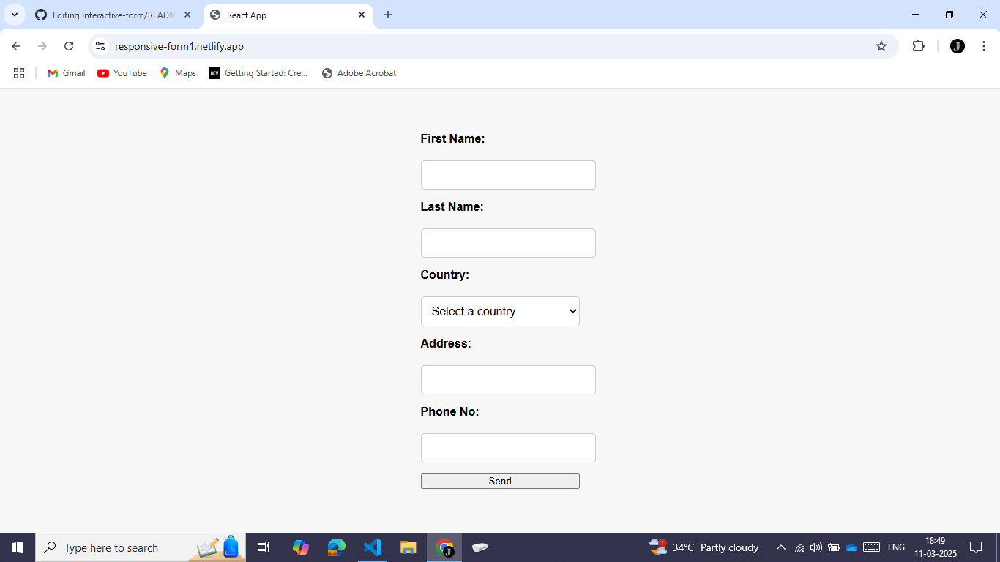

# Today I Learned

An interactive web form that allows users ensure a smooth and engaging experience.


---

## Features

👍 Validation of Fields: Validation of all fields .

📱 Responsive Design: Fully responsive and optimized for all devices.


---

## Technologies Used

Frontend: HTML, CSS, JavaScript, React

Deployment: Netlify


---

## Setup Instructions

1. Clone the Repository:
```
git clone https://github.com/your-username/interactive-form.git
cd interactive-form
```

2. Install Dependencies:
```
npm install
```


3. Run the App Locally:
```
npm start
```

5. Create Build Folder:
```
npm run build
```


6. Deploy on Netlify:

Link the repository to your Netlify account.


---

## Live Demo

Check out the live version here: [interactive-form](https://responsive-form1.netlify.app/)


---

## Contributing

Contributions are welcome! Feel free to fork the repository, make improvements, and submit a pull request.


---

## Screenshots

### 1. Home Page:
   
   
   


---

## Contact

For any queries or suggestions, reach out to me via:
GitHub: jaypachupate21
Email: [pachupatejay2102@gmail.com]

